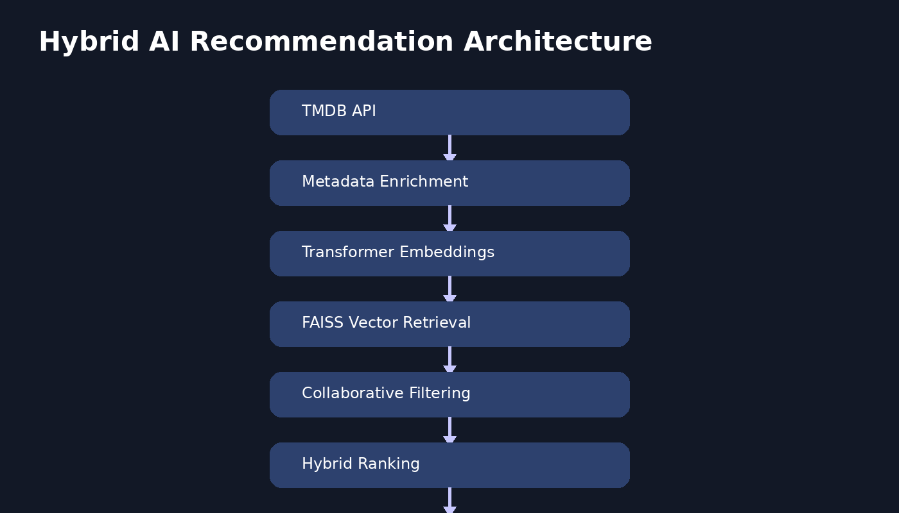
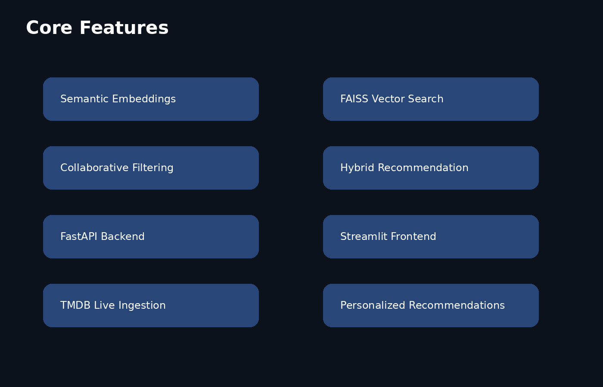

# Smart AI Movie Recommender


## Overview

Smart AI Movie Recommender is an end-to-end hybrid recommendation platform that combines semantic retrieval, collaborative filtering, and personalized ranking to generate intelligent movie recommendations.

The system integrates:
- Transformer-based semantic embeddings
- FAISS vector retrieval
- Matrix factorization using SVD
- Personalized user embeddings
- FastAPI backend services
- Streamlit frontend interface
- TMDB live movie ingestion

The project demonstrates modern recommendation system architecture inspired by production-grade retrieval and ranking systems.

---

## System Architecture



## Core Features

### Semantic Recommendation Engine
Uses transformer embeddings to capture contextual and thematic similarity between movies.

### FAISS Vector Search
Implements scalable nearest-neighbor retrieval for efficient semantic recommendations.

### Hybrid Recommendation System
Combines:
- Semantic similarity
- Collaborative filtering
- Personalized ranking

### Personalized Recommendations
Builds user preference embeddings using liked movies and interaction patterns.

### Live TMDB Integration
Fetches movie metadata dynamically using TMDB APIs.

### Interactive Frontend
Provides a Streamlit-based interface with:
- Searchable movie selection
- Recommendation visualization
- Movie posters
- Personalized recommendation workflow



---

## Technology Stack

| Category | Technologies |
|---|---|
| NLP & Embeddings | Sentence Transformers |
| Vector Retrieval | FAISS |
| Collaborative Filtering | Surprise SVD |
| Backend | FastAPI |
| Frontend | Streamlit |
| Data Sources | TMDB API, MovieLens |
| Language | Python |

---

## Project Structure

```bash
smart-ai-movie-recommender/
│
├── data/
├── frontend/
├── models/
├── notebooks/
├── src/
│   ├── api/
│   ├── embeddings/
│   ├── ingestion/
│   ├── ranking/
│   └── retrieval/
│
├── requirements.txt
└── README.md
```

---

## Installation

Clone the repository:

```bash
git clone https://github.com/NishuSingh28/smart-ai-movie-recommender.git

cd smart-ai-movie-recommender
```

Create virtual environment:

```bash
python3 -m venv venv

source venv/bin/activate
```

Install dependencies:

```bash
pip install -r requirements.txt
```

---

## Environment Variables

Create a `.env` file in the project root:

```env
TMDB_API_KEY=your_tmdb_api_key
```

---

## Running the Backend

Start FastAPI server:

```bash
uvicorn src.api.main:app --reload
```

API documentation:

```text
http://127.0.0.1:8000/docs
```

---

## Running the Frontend

Start Streamlit application:

```bash
streamlit run frontend/app.py
```

---

## Recommendation Workflow

1. User selects favorite movies
2. System generates user preference embeddings
3. FAISS retrieves semantically relevant candidates
4. Collaborative filtering reranks results
5. Hybrid ranking produces final recommendations

---

## Future Improvements

- Conversational recommendation agent
- Docker deployment
- CI/CD pipelines
- Vector databases (Qdrant/Pinecone)
- Recommendation explanations
- User authentication
- Watchlists and analytics
- Real-time recommendation updates

---

## Author

Nishu Singh

GitHub:
https://github.com/NishuSingh28
